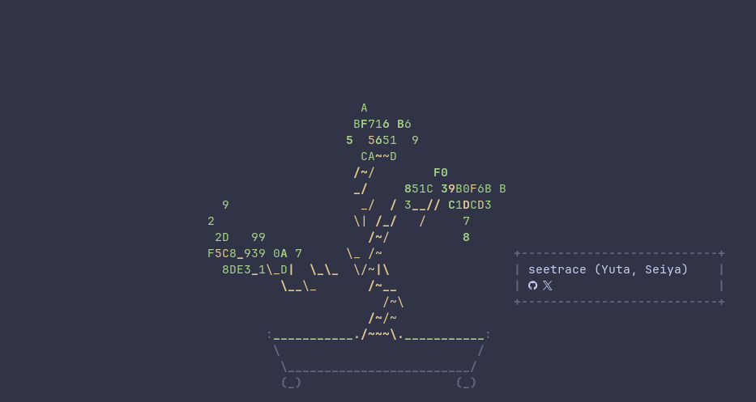

<div align="center">
  
</div>

<div align="center">
  
</div>

```console
~/yuta $ whoami
Seiya, Yuta
I build typed SvelteKit experiences in TypeScript, and when the browser isn't the right tool, I reach for Python, C, or PostgreSQL.
```

## About

<table>
  <tr>
    <td valign="middle" align="center" width="260">
      
    </td>
    <td valign="middle">
      <p>I’m a developer focused on building clean, type-safe interfaces with Svelte, SvelteKit, and TypeScript.</p>
      <p>When the browser isn’t the right layer for the problem, I switch to Python, C, or PostgreSQL to keep the work practical and efficient.</p>
      <p>Most of my current attention goes into Svelte work, personal Linux system configuration, and refining my workflow around a more deliberate NixOS + Hyprland setup.</p>
    </td>
  </tr>
</table>

## Current focus

- Svelte and SvelteKit application work
- Personal NixOS configuration in [nixos-dotfiles](https://github.com/seetrace/nixos-dotfiles)

## Featured projects

- [nixos-dotfiles](https://github.com/seetrace/nixos-dotfiles) — personal NixOS + home-manager configuration
- [numerals](https://github.com/seetrace/numerals) — POSIX numeral conversion utility written in C
- [seetrace](https://github.com/seetrace/seetrace) — this profile README and personal landing page
- Private Svelte projects — unpublished client and internal work

## Stack

<p>
  
</p>

## Stats

<p align="center">
  
  
  
</p>

<sub>~/seetrace $ exit</sub>
